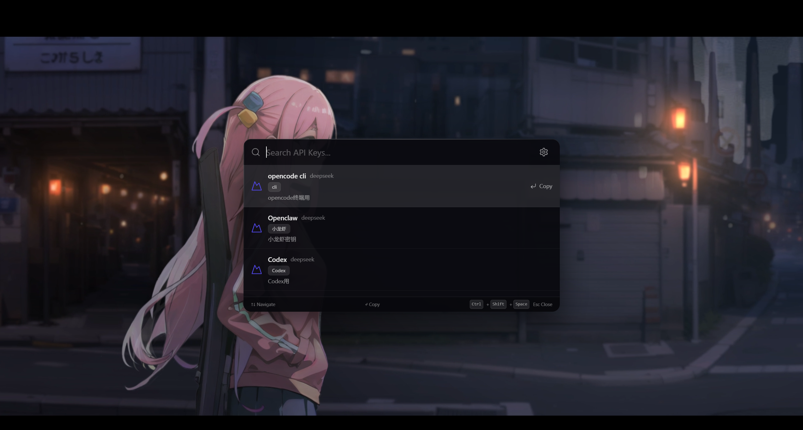
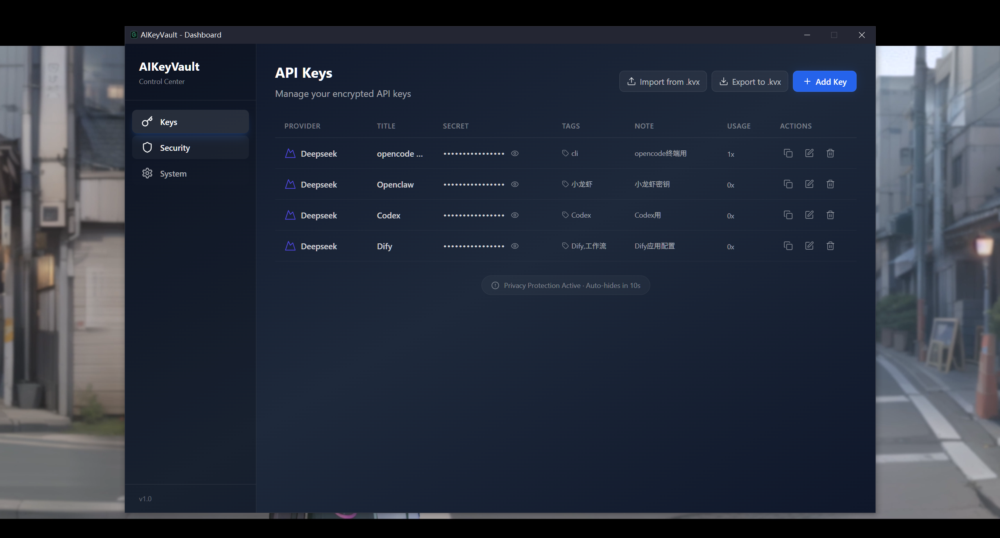
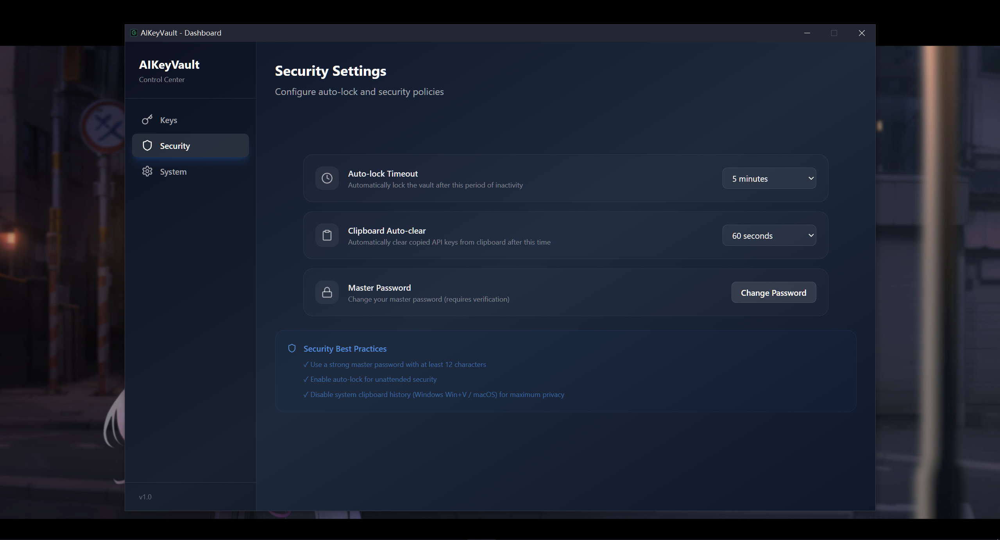
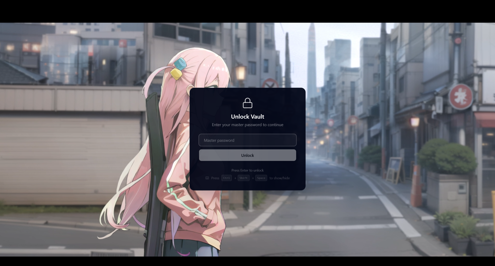
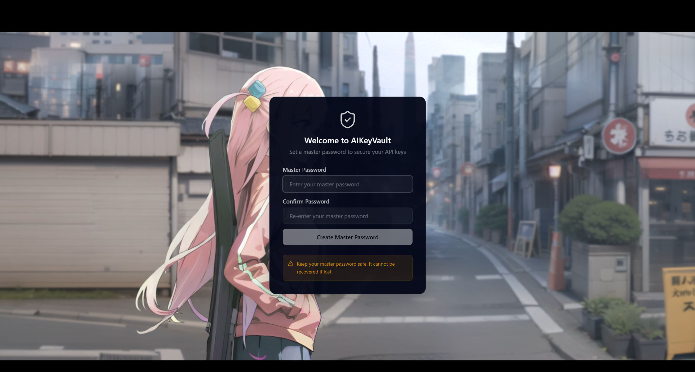
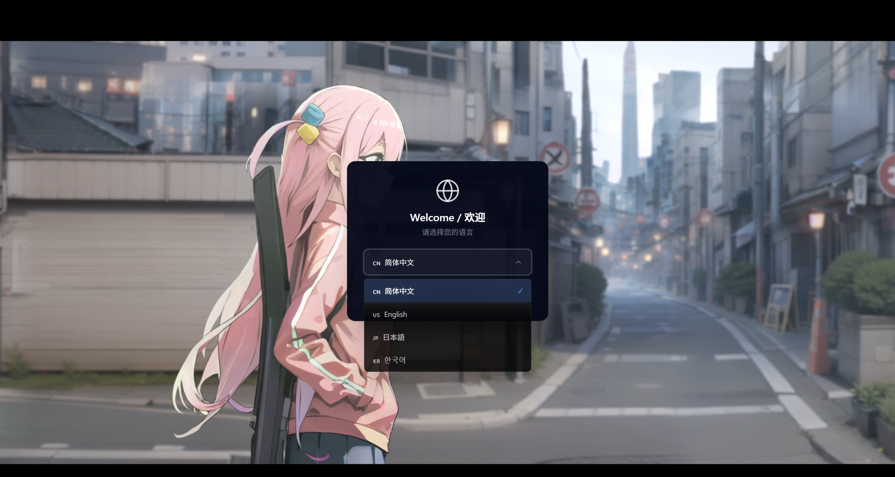

# AIKeyVault

<div align="center">

[](./LICENSE)
[]()
[](https://tauri.app/)
[](https://www.rust-lang.org/)
[](https://github.com/Awfp1314/AIKeyVault/releases)

**A local-first, security-focused API key manager for AI developers.**

[Features](#features) • [Screenshots](#screenshots) • [Installation](#installation) • [Usage](#usage) • [Security](#security) • [Development](#development)

*中文版：[README_zh-CN.md](./README_zh-CN.md)*

</div>

---

> 🔒 **100% Local. Zero Network Requests.** AIKeyVault never connects to the internet — no telemetry, no analytics, no cloud sync. **Your data never leaves your machine.** Trust is built on transparency: every line of encryption is open source and auditable.

AIKeyVault gives you instant, encrypted access to your AI provider API keys via a Raycast-style launcher.

## Features

- **AES-256-GCM Encryption** — Every key is independently encrypted with a random nonce. Your master password never leaves memory unprotected.
- **Argon2id Key Derivation** — 16 MiB memory-hard hashing makes brute-force attacks infeasible.
- **Raycast-Style Launcher** — Global shortcut (`Ctrl+Shift+Space`) pops up a transparent blur-glass search window. Type, copy, done.
- **Fuzzy Search** — Search across titles, provider names, and tags. Keyboard-driven: `↑↓` to navigate, `Enter` to copy.
- **Auto-Lock & Memory Safety** — Idle timeout locks the vault and zeroizes the master key from memory. Clipboard auto-clears after configurable delay.
- **Dark Mode + i18n** — Dark-first glassmorphism UI. Supports English, 简体中文, 日本語, 한국어.
- **Encrypted Backup** — Export to `.kvx` (AES-256-GCM encrypted). Safe to store or transfer anywhere.
- **System Tray** — Runs minimized. Quick access via tray menu.

## Screenshots

| Search Launcher | Keys Panel |
|:--:|:--:|
|  |  |

| Security Settings | Unlock Screen |
|:--:|:--:|
|  |  |

| Password Setup | Onboarding |
|:--:|:--:|
|  |  |


## Installation

### Download (Recommended)

> Pre-built installers will be available in the [Releases](https://github.com/Awfp1314/AIKeyVault/releases) page.
>
> *Last updated: add release date here*

| Platform | Package |
|----------|---------|
| Windows | `.msi` / `.exe` installer |
| macOS | `.dmg` |
| Linux | `.deb` / `.AppImage` |

### Build from Source

**Prerequisites:**
- [Rust](https://www.rust-lang.org/tools/install) >= 1.70
- [Node.js](https://nodejs.org/) >= 18
- **Windows**: [WebView2 Runtime](https://developer.microsoft.com/microsoft-edge/webview2/) (pre-installed on Windows 11)
- **Linux**: `libwebkit2gtk-4.1-dev` and system libraries (see [CONTRIBUTING.md](./CONTRIBUTING.md) for exact package lists)
- **macOS**: No extra dependencies

```bash
# Clone & install
git clone https://github.com/Awfp1314/AIKeyVault.git
cd AIKeyVault
npm install

# Development (hot-reload for both Rust and React)
npm run tauri dev

# Production build
npm run tauri build
# Output: src-tauri/target/release/bundle/
```

## Usage

### First Launch

1. Choose your language
2. Create a strong master password (6+ characters)
3. The vault is ready — start adding API keys

### Daily Workflow

| Action | Shortcut / Path |
|--------|----------------|
| Open search | `Ctrl+Shift+Space` (configurable) |
| Search keys | Type title / provider / tag |
| Copy selected key | `Enter` |

| Open Dashboard | Search window gear icon or tray menu |
| Lock vault | Tray menu → Lock Vault, or auto-lock timeout |
| Export / Import | Dashboard → Keys panel |

### Adding an API Key

1. Open Dashboard (`Ctrl+Shift+Space` → gear icon, or tray menu)
2. Go to **Keys** panel
3. Click **Add Key**
4. Fill in: Title, Provider, API Key secret, Tags (optional)
5. Save — the key is encrypted and stored locally

### Backup & Restore

Export your encrypted vault as a `.kvx` file. Store it safely (USB drive, private cloud, etc.). Import with the same export password on any machine.

## Supported Providers

OpenAI · Anthropic (Claude) · Google (Gemini) · DeepSeek · OpenRouter ·
Azure OpenAI · SiliconFlow · Volcengine · Alibaba (百炼) · Tencent (混元) ·
**Custom** (any service with an API key)

## Security

### Encryption Flow

```
Master Password
       │
       ▼  Argon2id (16 MiB, 2 iter, 4 parallel)
256-bit Master Key
       │
       ▼  AES-256-GCM (random 96-bit nonce per key)
Ciphertext → SQLite BLOB
```

### Design Principles

- **IPC Isolation** — The React frontend receives only item IDs and metadata (`VaultItemMeta`). All cryptographic operations happen in the Rust backend. Plaintext secrets never cross the IPC boundary (one exception: `reveal` command auto-masks after 10 seconds).
- **Memory Hardening** — Master key wrapped in `Zeroizing<Vec<u8>>`. On lock, memory is zeroed before deallocation. No swap leakage.
- **Clipboard Protection** — Privacy flags injected on macOS. Auto-clear timer (30s / 60s / 5min / never) clears the system clipboard.
- **Per-Record Nonces** — Each vault item gets its own 96-bit random nonce. Reusing a nonce would compromise AES-GCM security — we prevent that entirely.
- **No Telemetry** — AIKeyVault makes zero network requests. No analytics, no crash reports, no update checks that phone home.

### What AIKeyVault is NOT

- **NOT a cloud service** — Data never leaves your machine.
- **NOT a password manager** — It won't sync across devices, fill browser forms, or store credentials for non-AI services.
- **NOT a CLI tool** — It's a desktop GUI app designed for speed and visual feedback.

## Development

```bash
npm run dev           # Frontend-only Vite dev server (port 1420)
npm run build         # TypeScript type-check + Vite production build
npm run tauri dev     # Full Tauri dev (Rust backend + React frontend)
npm run tauri build   # Production installer
npm run check         # Full check: tsc + cargo clippy
npm run lint          # Rust lint + format check
```

See [CONTRIBUTING.md](./CONTRIBUTING.md) for development workflow, code style, and system dependency details.

## Project Structure

```
AIKeyVault/
├── src/                         # React 18 + TypeScript frontend
│   ├── components/              # Shared UI components
│   │   ├── GlobalStateListener.tsx   # Cross-window lock event sync
│   │   ├── ProviderIcon.tsx          # AI provider logo component
│   │   └── VaultItemRow.tsx          # Key list row with mask/unmask
│   ├── pages/                   # Page-level components
│   │   ├── OnboardingView.tsx        # First-launch master password setup
│   │   ├── UnlockView.tsx            # Lock screen / vault unlock
│   │   ├── SearchPage.tsx            # Main search launcher window
│   │   ├── DashboardPage.tsx         # Settings & key management window
│   │   └── dashboard/                # Dashboard sub-panels
│   ├── hooks/                   # Custom React hooks
│   │   ├── useVault.ts               # IPC wrapper for vault commands
│   │   ├── useHeartbeat.ts           # User activity heartbeat throttle
│   │   └── useSearchKeyboard.ts      # Search list keyboard navigation
│   └── i18n/locales/            # Language packs
│       ├── en-US.json
│       ├── zh-CN.json
│       ├── ja-JP.json
│       └── ko-KR.json
│
├── src-tauri/src/               # Rust backend
│   ├── crypto/                  # Encryption layer
│   │   ├── argon2.rs                # Argon2id: salt gen, key derivation, verification
│   │   └── aes.rs                   # AES-256-GCM: encrypt/decrypt with per-item nonce
│   ├── vault/                   # Core vault logic
│   │   ├── state.rs                 # State machine (FirstLaunch → Unlocked ⇄ Locked)
│   │   └── manager.rs               # VaultItem CRUD, search, clipboard copy
│   ├── database/sqlite.rs       # SQLite operations (app_metadata + vault_items)
│   ├── clipboard/manager.rs     # Clipboard write with auto-clear & privacy mark
│   ├── shortcut/manager.rs      # Global shortcut register/update/unregister
│   ├── tray/manager.rs          # System tray menu (Show / Lock / Quit)
│   ├── import_export/kvx.rs     # .kvx encrypted backup format
│   └── commands/                # Tauri IPC command handlers
│       ├── vault.rs                 # Vault lifecycle + item CRUD commands
│       └── settings.rs              # Settings, heartbeat, window management
│
├── docs/PRD.md                  # Product requirements document
├── design/app-icon.png          # Source icon asset
├── CONTRIBUTING.md              # Contribution guide
├── AGENTS.md                    # Architecture notes for AI coding assistants
└── CLAUDE.md                    # Project instructions for Claude Code
```

## License

MIT — see [LICENSE](./LICENSE).

## Acknowledgments

Built with [Tauri 2.0](https://tauri.app/), [React](https://react.dev/), [Rust](https://www.rust-lang.org/), and [Tailwind CSS](https://tailwindcss.com/).
